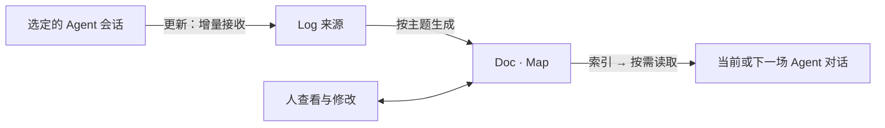

# GFT Map

**可看、可改、可带走的 Agent 主题上下文。**

把围绕一件事的聊天整理成一份持续更新的理解：在 **Doc** 里读和修改，在 **Map** 里看判断与关系，保留 **Log** 供追溯。下一场 Agent 对话按需读取它，接着推进同一件事。

GFT Map 在本机运行，复用 [Git for Thought](https://gitforthought.com) 的图文编辑与整理能力。这个仓库包含完整本地应用源码；Skill 是它的一种安装方式。

适合已经在 Codex 或 Claude Code 里持续推进一件事的人：讨论分散在不同会话，隔天回来或换个 Agent 时，又要解释一遍已有决定。GFT Map 把这份理解放在你能查看和纠正的地方，让后续对话按需取用。

[下载安装包](https://github.com/CoralLips/gft-map/releases/latest) · [高级配置与原理](https://github.com/CoralLips/gft-map/blob/main/apps/gft-local/ADVANCED.md) · [反馈问题](https://github.com/CoralLips/gft-map/issues)

## 它能做什么

- **围绕主题保存。**连接明确的聊天会话，增量接收新消息；主题决定 Doc／Map 展示什么，Log 保留已接收的来源。
- **人能直接纠正。**修改主题、文稿或节点，再让 Agent 读取当前版本。判断的依据、状态和关系都可见。
- **跨对话继续。**一个对话可连接多个主题，同一主题也可供多场对话使用。Agent 先看简短索引，再决定读哪些正文。
- **独立携带。**导出单个主题的完整文件，在另一份 GFT Map 或兼容的 GFT 平台导入；本地使用无需 GFT 账号。



## 第一次使用：Codex

准备已经登录的 **Codex CLI**。GitHub 一键安装建议使用 **Node.js 22.20+**，满足当前 `skills` 安装工具的要求；手动安装 Release 时，GFT Map 本身支持 **Node.js 20+**。仅安装聊天客户端，不一定已具备可用的 CLI；下面的检查命令会说明缺少什么。模型操作使用执行器现有账号的额度和配置。

### 1. 安装完整 Skill

通过 [skills 安装工具](https://github.com/vercel-labs/skills) 从 GitHub 安装到 Codex：

```sh
npx skills add CoralLips/gft-map --skill gft-map --agent codex --global
```

Claude Code 将 `--agent codex` 换成 `--agent claude-code`。安装工具会显示实际安装路径；`--global` 表示当前用户的各个项目都能使用。安装后，重新打开 Agent 或刷新技能列表。

仓库的 `skills/gft-map/` 是完整安装目录，包含说明、脚本和已经构建的界面；安装工具复制这个目录，无需编译应用或访问 GFT 私有仓。Node.js 和所用 Agent CLI 仍需事先安装。

也可以从 [Releases](https://github.com/CoralLips/gft-map/releases/latest) 下载 `gft-map-<版本号>.tar.gz`，解压后手动安装。GitHub 自动附带的 **Source code** 留给源码开发使用。保留整个 `gft-map` 文件夹，不能只复制 `SKILL.md`；包中已包含应用运行依赖，无需再执行 `npm install`。

手动安装时，将文件夹放到你使用的 Agent 技能目录：

| Agent | 用户级安装位置 |
|---|---|
| Codex | `~/.agents/skills/gft-map/` |
| Claude Code | `~/.claude/skills/gft-map/` |

`~` 表示用户主目录；Windows 通常是 `C:\Users\你的用户名`。确保该目录内直接有 `SKILL.md` 和 `scripts/`，没有再套一层同名文件夹。安装位置依据 [Codex 官方说明](https://learn.chatgpt.com/docs/build-skills) 与 [Claude Code 官方说明](https://code.claude.com/docs/en/skills)。Claude 的支持范围见下文。

### 2. 启动本地面板

在安装后的 `gft-map` 目录打开终端，运行：

```sh
node scripts/cli.mjs doctor --agent codex
node scripts/cli.mjs serve --port 4317 --agent codex
```

检查通过后，打开 **http://127.0.0.1:4317/**。保留这个终端；按 `Ctrl+C` 可停止服务，已经保存的主题仍保留。`--agent codex` 使页面的更新、整理、重画按钮能够执行模型任务。

### 3. 得到第一份主题上下文

1. 在页面新建脉络，点 **更新**。
2. 选择一场已有几轮讨论的短对话，选 **包含已有内容** 并确认。这样第一次就有材料可生成。若选 **从现在开始**，需先在那场聊天完成新一轮，再回来更新；没有新材料时不会生成内容。
3. 等任务完成，在 Doc 阅读，在 Map 查看；首次会自动生成主题范围和名称。
4. 有不准确的地方，直接修改。之后点击更新，只接收尚未收录的消息；没有新增就不调用模型。

想调整方向，可以改 Doc 顶部的主题范围，再点重画。长历史会分批提炼，最终汇总成图文；进度可见，支持取消，处理时间和额度用量取决于材料与执行器。

工具栏以圆角标签显示已连接会话，保持单行；超出显示宽度时可横向滚动查看。点标签管理连接，点对应的 × 单独断开。多场会话连接到同一主题时，点击更新会让你选择这次的来源。

### 4. 让 Agent 读回去

回到本机 Agent，选择 `gft-map` Skill，或明确说：

> 使用 gft-map，查看本场已经连接的主题索引，读取与当前任务有关的内容。先告诉我你读到了什么，再继续工作。

开启新对话时，可以说：

> 使用 gft-map，连接「产品发布计划」这份主题，然后读取当前理解。

将示例名称换成自己的主题。Skill 通过 CLI 操作同一个本地服务；**网页连接成功不等于记忆已经进入聊天**。右侧修改后，Agent 下一次读取才会得到新版，不会自动唤醒聊天或每轮塞入全文。客户端未发现新 Skill 时，刷新技能列表或重新打开会话。

可以做一次简单检查：把 Doc 中一项“已确定”的判断改为“待验证”，保存后让 Agent 重新读取这个主题并说明当前结论。它应保留你的修正。再开一场对话连接同一主题，检查能否接着工作。若结果不符，请记录复现步骤并反馈；仅显示“已连接”不代表这轮记忆复用已完成。

## 三个按钮的区别

| 操作 | 用途 |
|---|---|
| 更新 | 从已连接会话接收增量材料，保存到 Log，再按主题更新 Doc／Map。 |
| 整理 | 理顺当前主题表述、手写文稿和现有节点，收拢重复判断；保留主题边界、依据和转折。 |
| 重画 | 保留当前主题，从已保存的 Log 重新生成 Doc／Map；不重新扫描聊天、不重置增量进度。 |

主题是可修改的过滤范围。Log 记录已经接收的来源，不因主题改变而删除；旧数据若只有提取记录，无法恢复从未保存的原文。

## 支持范围

| 能力 | 当前状态 |
|---|---|
| 本地面板、Doc／Map 编辑、文件迁移 | 可用；无需 GFT 登录。 |
| Codex 页面执行 | 已做真实任务验收；使用临时 CLI 任务，不保存新的聊天历史。 |
| Codex／Claude Code 聊天来源 | 按明确会话读取，分别保存增量位置；不全量扫描所有聊天正文。 |
| Claude ACP 执行 | 实验性；协议测试通过，真实生成与跨客户端续接仍待完整验收。 |
| MCP 连接表单与读取工具 | 可选；表单是否显示取决于客户端，网页连接入口可独立使用。 |
| GFT 账号 | 可选网页授权；不自动同步或上传主题。 |

读取来源和执行模型是两件事：例如用 Codex 执行器处理一场 Claude Code 聊天。支持 ACP 协议不代表所有 Agent 的历史读取都已适配。

需要 MCP 原生工具时，保持服务运行，再执行 `node scripts/cli.mjs mcp-config`，按输出配置本地 MCP 服务。详细参数见 [连接说明](https://github.com/CoralLips/gft-map/blob/main/apps/gft-local/skill/references/connections.md) 和 [高级配置](https://github.com/CoralLips/gft-map/blob/main/apps/gft-local/ADVANCED.md)。默认不安装通知 Hook。

## 数据、账号与迁移

数据默认存放于 `~/.gft-local/`，可用 `GFT_LOCAL_HOME` 更改。**页面和 Skill 必须使用同一个数据目录。**升级安装包不会替换该目录；升级前可导出重要主题作为备份。

本地文件不会自动上传 GFT。使用联网执行器时，任务所需材料会发送给该执行器的模型服务，并使用它的额度；“存储在本地”不等于“模型离线运行”。默认模型与思考强度来自执行器配置，不跟随另一场聊天输入框。

“完整脉络包 .json”包含当前单个主题的名称、范围、图文与 Log，不含账号凭证、会话连接或增量水位。导入创建新主题，不覆盖原主题。使用 `gft-theme` v2，兼容旧 v1；单包上限 4 MB，超过会报错，不截断。自动云同步尚未提供。

## 从源码运行

```sh
git clone https://github.com/CoralLips/gft-map.git
cd gft-map
npm ci
npm run build
node apps/gft-local/cli.mjs doctor --agent codex
npm start -- --agent codex
```

源码运行与 Skill 安装包二选一即可。省略 `--agent codex` 时，仅启动本地查看和编辑模式；不会启用页面模型执行器。

检查与打包：

```sh
npm run typecheck
npm test
npm run pack:skill
npm run test:skill -- apps/gft-local/release/gft-map
```

`pack:skill` 根据你当前修改后的源码生成安装包及 `SHA256SUMS`，需要系统 `tar`；不要求源码保持官方导出时的样子。只需要完整技能目录时，可运行 `npm run build:skill`，结果在 `apps/gft-local/release/gft-map/`。`test:skill` 在临时目录验证启动、页面资源、保存和读取，不使用真实聊天或调用模型。

公开仓可独立构建、修改，不依赖私有仓。`src/` 是共享组件与逻辑，`apps/gft-local/` 是本地应用，`skills/gft-map/` 是随正式版本生成的安装目录。开发请修改源码，重新构建自己的安装包；不要手改生成目录。贡献请提交 PR，涉及共享功能的修改会合回维护源，再统一导出。

`SOURCE-MANIFEST.json` 仅记录官方导出的来源，不参与普通构建、PR 检查或打包；`check:source` 是维护者可选的原始快照核对工具，修改源码后不需要运行或更新它。下载附件的 `SHA256SUMS` 用来核对安装包是否完整，与限制源码修改无关。

## 常见问题

- **页面打不开：**确认终端中的服务仍在运行，且端口是 4317。查看启动错误，不重复启动多个服务抢同一端口。
- **按钮提示执行器不可用：**用 `doctor --agent codex` 检查 Codex CLI 和登录；启动时加 `--agent codex`。路径检测失败时见高级配置的 `GFT_CODEX_BIN`。
- **已经连接，但 Agent 不知道内容：**连接只保存关系。让 Agent 使用 `gft-map` 查看索引并读取所需主题。
- **第一次更新提示没有新增：**如果连接时选了“从现在开始”，先完成一轮新对话再更新；如果已有内容都已收录，则无需重复处理。
- **原来的主题不见了：**先核对页面、CLI 的 `GFT_LOCAL_HOME`，不要删除数据或重建来覆盖问题。
- **使用 Claude：**Skill 与聊天来源已适配；网页执行还需 Claude ACP 适配器与有效登录，详见高级配置。首版优先提供已验收的 Codex 路径。

## License

MIT。安装包附带打包依赖的许可证；第三方 Agent 和模型服务遵循各自条款。
